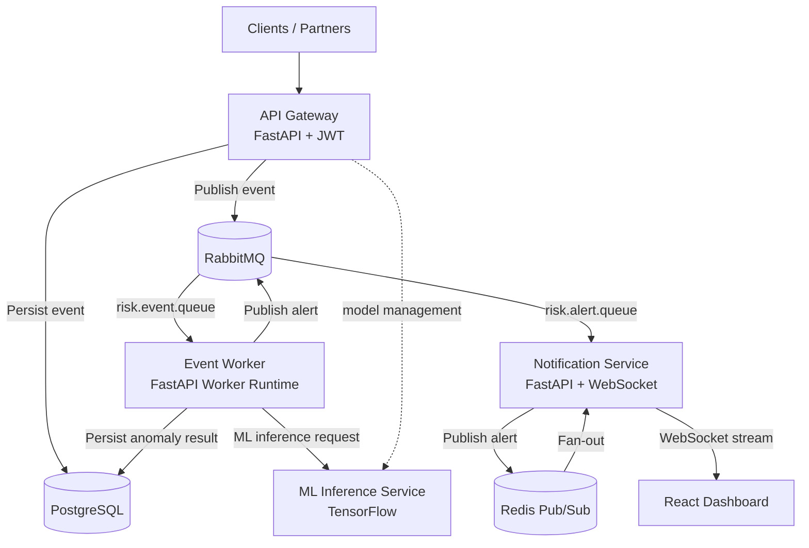
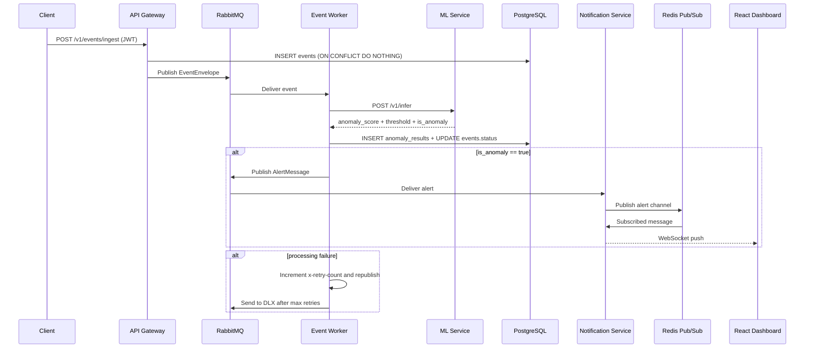
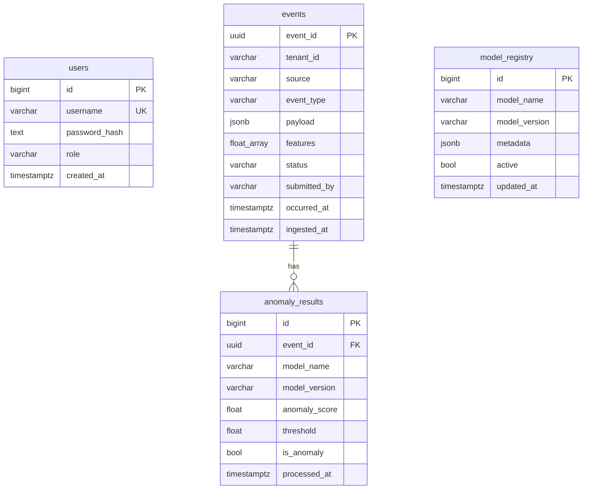

# Real-Time AI Risk Monitoring System

## 1) High-Level Architecture

## 2) Service Responsibilities

### API Gateway (FastAPI)
- JWT authentication (`/v1/auth/token`).
- Event ingestion REST endpoint (`/v1/events/ingest`).
- Idempotent insert on `events.event_id` primary key.
- Publishes accepted events to RabbitMQ exchange.
- Proxies model management APIs to ML service.
- Health checks: `/health/live`, `/health/ready`.

### Event Worker
- Consumes ingested events from RabbitMQ.
- Calls ML service for anomaly scoring.
- Writes results to `anomaly_results`, updates event status.
- Publishes anomaly alerts to alert exchange.
- Retry strategy with header `x-retry-count`.
- Dead-letter routing after max retries.
- Idempotency via Redis key (`processed:{event_id}`).
- Health checks: `/health/live`, `/health/ready`.

### ML Inference Service
- TensorFlow autoencoder-based inference (`/v1/infer`).
- Model training endpoint (`/v1/models/train`).
- Model activation and active-model lookup.
- Versioned model persistence in `/models`.
- Dynamic threshold from validation reconstruction error quantile.
- Health checks: `/health/live`, `/health/ready`.

### WebSocket Notification Service
- Consumes alert messages from RabbitMQ.
- Publishes alert payloads to Redis channel (`risk.live.alerts`).
- Subscribes Redis Pub/Sub channel and broadcasts over WebSocket.
- Authenticated WebSocket endpoint (`/ws/risk-stream?channels=alerts,metrics&token=...`).
- Health checks: `/health/live`, `/health/ready`.

## 3) Data Flow

## 4) Database Schema

## 5) Reliability and Idempotency

- Ingestion idempotency: primary key on `events.event_id`.
- Processing idempotency: Redis `processed:{event_id}` cache.
- Retry control: Rabbit message header `x-retry-count`.
- Dead letter: exhausted events moved to `risk.events.dlq` via DLX exchange.
- Manual acknowledgment after deterministic handling.

## 6) Horizontal Scalability

- API Gateway: stateless, scale behind L4/L7 load balancer.
- Event Worker: scale consumer replicas by queue depth/lag.
- ML Service: scale inference replicas; pin CPU/GPU pools separately.
- Notification Service: scale WebSocket nodes with Redis Pub/Sub fan-out.
- RabbitMQ: quorum queues for durability in production.
- PostgreSQL: read replicas for analytics; partition `events` by time/tenant.

## 7) Potential Bottlenecks

- ML inference latency under burst load.
- PostgreSQL write contention on hot tenants.
- WebSocket fan-out throughput on single notification instance.
- RabbitMQ queue lag if worker autoscaling is conservative.

## 8) Mitigation Strategies

- Batch inference or async micro-batching in ML service.
- Separate hot/cold storage, and partitioned indexes.
- Autoscale workers by queue depth and processing latency SLO.
- Redis Cluster and sharded WS nodes for 10k+ clients.
- Backpressure + circuit breakers for dependent services.
